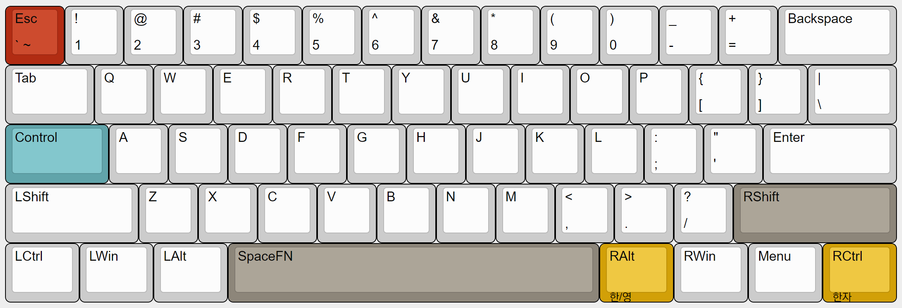
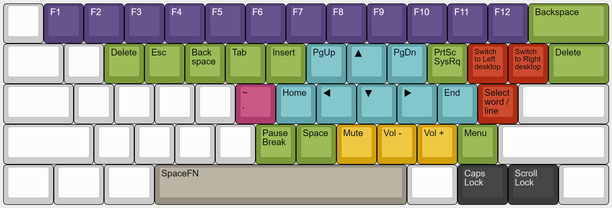

# my-kanata

> **Improve keyboard comfort and usability with advanced customization**

### **Based on : jtroo's [kanata](https://github.com/jtroo/kanata) project**

### **Releases : [kanata releases](https://github.com/jtroo/kanata/releases)**

### **Config sample : [kanata.kbd](https://github.com/jtroo/kanata/blob/main/cfg_samples/kanata.kbd)**

### **Key list : [mod.rs](https://github.com/jtroo/kanata/blob/main/parser/src/keys/mod.rs)**

# layout

## Base Layer

top-left red key : Esc / Grave

yellow highlight key : KR keyboard

[keyboard-layout-editor-base](http://www.keyboard-layout-editor.com/##@_author=Ahn%20Giju&notes=v1.2.0%0A%0A20231210%2F:%20Restore%20RShift-layer%20for%20RWinless%20keyboard(e.g.%20LEOPOLD%20660)%0A%0Av1.1.0%0A%0A20231113%2F:%20Remove%20RShift-layer,%20Import%20RWin-layer%0A%0Av1.0.0%0A%0A20231009%2F:%20Base%20layer%3B&@_c=%23d02f1c%3B&=Esc%0A%60%20~&_c=%23cccccc%3B&=!%0A1&=%2F@%0A2&=%23%0A3&=$%0A4&=%25%0A5&=%5E%0A6&=%2F&%0A7&=*%0A8&=(%0A9&=)%0A0&=%2F_%0A-&=+%0A%2F=&_w:2%3B&=Backspace%3B&@_w:1.5%3B&=Tab&=Q&=W&=E&=R&=T&=Y&=U&=I&=O&=P&=%7B%0A%5B&=%7D%0A%5D&_w:1.5%3B&=%7C%0A%5C%3B&@_c=%2300a4a9&w:1.75%3B&=Control&_c=%23cccccc%3B&=A&=S&=D&=F&=G&=H&=J&=K&=L&=%2F:%0A%2F%3B&=%22%0A'&_w:2.25%3B&=Enter%3B&@_w:2.25%3B&=LShift&=Z&=X&=C&=V&=B&=N&=M&=%3C%0A,&=%3E%0A.&=%3F%0A%2F%2F&_c=%2391867a&w:2.75%3B&=RShift%3B&@_c=%23cccccc&w:1.25%3B&=LCtrl&_w:1.25%3B&=LWin&_w:1.25%3B&=LAlt&_c=%2391867a&w:6.25%3B&=SpaceFN&_c=%23e5a100&a:0&w:1.25%3B&=RAlt%0A%0A%0A%0A%ED%95%9C%2F%2F%EC%98%81&_c=%23cccccc&a:4&w:1.25%3B&=RWin&_w:1.25%3B&=Menu&_c=%23e5a100&a:0&w:1.25%3B&=RCtrl%0A%0A%0A%0A%ED%95%9C%EC%9E%90)

## SpaceFn Layer

blank keys are transparent

[keyboard-layout-editor-spacefn](http://www.keyboard-layout-editor.com/##@_author=Ahn%20Giju&notes=v3.0.0%0A%0A20240212%2F:%20full-change,%20qmk%20style%20layer%20design%20for%20project-kanata!%0A%0Av2.0.0%0A%0A20231210%2F:%20upgrade%20functionality%0A%0Av1.2.0%0A%0A20231111%2F:%20fully%20redesigned,%20Add%20function%20row%20in%20spacefn%20%2F&%20etc.%0A%0Av1.1.0%0A%0A20231027%2F:%20Navigation%20keys%20reconfiguration%20and%20layout%20optimization%0A%0Av1.0.0%0A%0A20231009%2F:%20SpaceFN%20layer%3B&@_a:7%3B&=&_c=%235d437e&t=%23ffffff&a:4%3B&=F1&=F2&=F3&=F4&=F5&=F6&=F7&=F8&=F9&=F10&=F11&=F12&_c=%23689b34&t=%23000000&w:2%3B&=Backspace%3B&@_c=%23cccccc&a:7&w:1.5%3B&=&=&_c=%23689b34&a:4%3B&=Delete&=Esc&=Back%20space&=Tab&=Insert&_c=%2300a4a9%3B&=PgUp&_f:4%3B&=%E2%96%B2&_f:3%3B&=PgDn&_c=%23689b34%3B&=PrtSc%20SysRq&_c=%23d02f1c&f:2%3B&=Switch%20to%20Left%20desktop&=Switch%20to%20Right%20desktop&_c=%23689b34&f:3&w:1.5%3B&=Delete%3B&@_c=%23cccccc&a:7&w:1.75%3B&=&=&=&=&=&_c=%23cb3d6e&a:4%3B&=~%0A%60&_c=%2300a4a9%3B&=Home&=%E2%97%80&_f:4%3B&=%E2%96%BC&_f:3%3B&=%E2%96%B6&=End&_c=%23d02f1c%3B&=Select%20word%20%2F%2F%20line&_c=%23cccccc&a:7&w:2.25%3B&=%3B&@_w:2.25%3B&=&=&=&=&=&_c=%23689b34&a:4%3B&=Pause%20Break&=Space&_c=%23e5a100%3B&=Mute&=Vol%20-&=Vol%20+&_c=%23689b34%3B&=Menu&_c=%23cccccc&a:7&w:2.75%3B&=%3B&@_w:1.25%3B&=&_w:1.25%3B&=&_w:1.25%3B&=&_c=%239b9284&a:4&w:6.25%3B&=SpaceFN&_c=%23cccccc&a:7&w:1.25%3B&=&_c=%23393b3b&t=%23b2b2b2&a:4&w:1.25%3B&=Caps%20Lock&_w:1.25%3B&=Scroll%20Lock&_c=%23cccccc&t=%23000000&a:7&w:1.25%3B&=)

| key       | action                          |
| --------- | ------------------------------- |
| 1~9,0,-,= | F1~12                           |
| \         | Delete                          |
| w         | Waste(delete)                   |
| e         | Escape                          |
| r         | Remove(backspace)               |
| t         | Tab                             |
| y         | Insert                          |
| u         | page Up                         |
| i,j,k,l   | up, left, down, right           |
| o         | page dOwn                       |
| p         | Printscreen                     |
| [         | switch to left virtual desktop  |
| ]         | switch to right virtual desktop |
| g         | Grave accent (backtick)         |
| h         | Home                            |
| ;         | End                             |
| '         | select current word             |
| b         | Break(pause)                    |
| n         | space                           |
| m         | Mute                            |
| ,         | volume down (<)                 |
| .         | volume up (>)                   |
| /         | context menu (?)                |

## Numpad Layer

SpaceFn-D | Digit

## Mouse Action Layer

SpaceFn-F | Func(Mouse)

## Combos
| key   | action |
| ----- | ------ |
| (d f) | (      |
| (j k) | )      |
| (s d) | {      |
| (k l) | }      |
| (s f) | [      |
| (j l) | ]      |
| (e f) | - _    |
| (j i) | = +    |